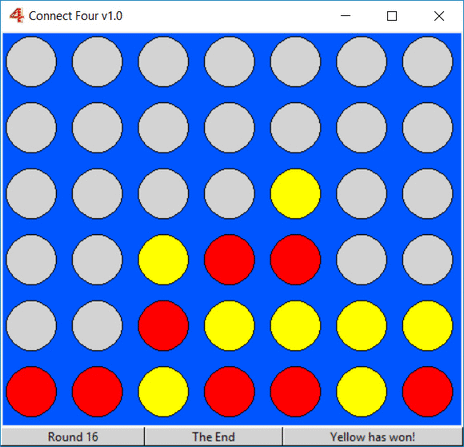

Connect Four
------------
[](https://travis-ci.org/Acamol/connect-four)



The Connected Four game written in Python with Tkinter for GUI.

Install
-------
The game requires Python 3.

```
git clone git://github.com/Acamol/connect-four.git 
cd connect-four/ConnectFour
python Game.py
```

Testing
-------
Test results of the latest build can be seen [Here](https://travis-ci.org/Acamol/connect-four). If you wish to run the test for yourself, you need to install the modules listed in `test-requirements.txt` (Linux):
```
pip install -r test-requirments.txt
```
And to run them with:
```
PYTHONPATH=./ConnectFour py.test tests/
````
For coverage:
```
PYTHONPATH=./ConnectFour py.test --cov=. tests/
```